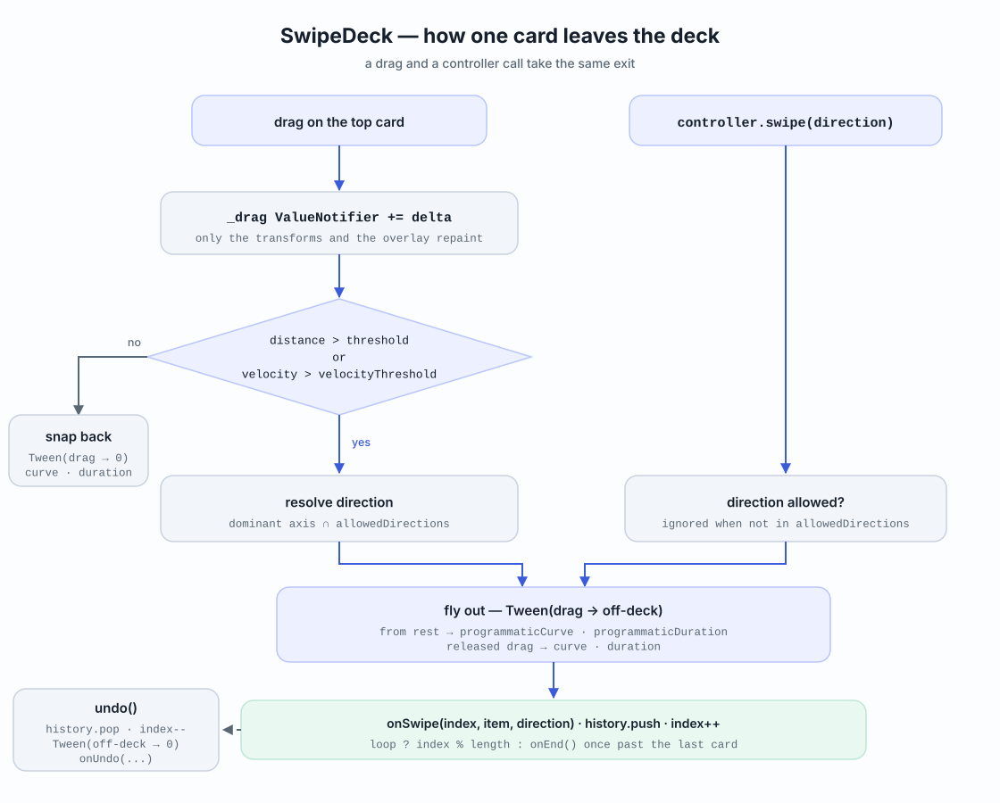
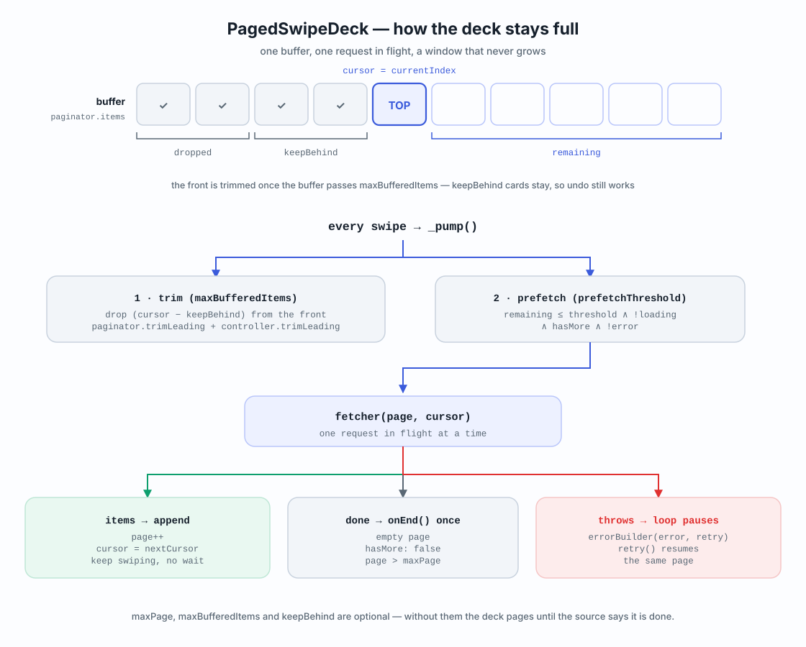

# flutter_swipe_deck

[](https://pub.dev/packages/flutter_swipe_deck)
[](LICENSE)

A customizable Tinder-style swipeable card deck for Flutter — drag a card away,
throw it with a button, take it back with undo, and paint your own badges while
it moves. Feed it a fixed list, or let it page through a feed of any size.

No third-party dependencies. Works with any item type.

## Features

- **Any data** — `SwipeDeck<T>` builds your own widget for every item.
- **Four directions** — left and right by default, opt into up and down.
- **Controller** — `swipeLeft()`, `swipeRight()`, `swipeUp()`, `swipeDown()`,
  `swipe(direction)`, `undo()` and `moveTo(index)`.
- **Undo** — the last card slides back in from where it left.
- **Drag overlays** — build LIKE / NOPE badges that follow the swipe progress.
- **Tunable stack** — how many cards show behind, how far back they sit, how
  much the top card tilts, how far it must travel, how fast it animates.
- **Pagination** — `PagedSwipeDeck` prefetches the next page while the user is
  still swiping the current one.
- **Loop mode**, **empty state**, **haptics** and a **read-only mode** for
  button-only decks.

## How it works

Every card leaves the deck through the same path, whether the user threw it or
a button did. Dragging only moves transforms — the cards themselves are not
rebuilt.



## Getting started

```yaml
dependencies:
  flutter_swipe_deck: ^1.2.0
```

```dart
import 'package:flutter_swipe_deck/flutter_swipe_deck.dart';
```

## Usage

```dart
SwipeDeck<Profile>(
  items: profiles,
  itemBuilder: (context, profile, index) => ProfileCard(profile),
  onSwipe: (index, profile, direction) {
    if (direction == SwipeDirection.right) like(profile);
  },
  onEnd: () => debugPrint('deck finished'),
)
```

The deck keeps its own cursor into `items`, so the list you pass in never has
to change. `onSwipe` tells you which item left and which way it went.

### Driving it from buttons

```dart
final controller = SwipeDeckController();

SwipeDeck<Profile>(
  controller: controller,
  items: profiles,
  itemBuilder: ...,
);

Row(
  children: [
    IconButton(onPressed: controller.swipeLeft, icon: const Icon(Icons.close)),
    IconButton(onPressed: controller.undo, icon: const Icon(Icons.undo)),
    IconButton(onPressed: controller.swipeRight, icon: const Icon(Icons.favorite)),
  ],
)
```

### Badges while dragging

`overlayBuilder` runs for the card being dragged. `progress` goes from `0` to
`1`, hitting `1` exactly when releasing would complete the swipe.

```dart
overlayBuilder: (context, direction, progress) {
  if (direction == SwipeDirection.up) return null; // nothing for super-likes
  return Opacity(
    opacity: progress,
    child: Align(
      alignment: direction == SwipeDirection.right
          ? Alignment.topLeft
          : Alignment.topRight,
      child: Text(direction == SwipeDirection.right ? 'LIKE' : 'NOPE'),
    ),
  );
},
```

### Swiping up and down

```dart
SwipeDeck<Profile>(
  allowedDirections: SwipeDirection.all, // or .horizontal, .vertical, or your own list
  ...
)
```

## Unlimited content with pagination

`PagedSwipeDeck` keeps the deck topped up while the user swipes. Give it a
fetcher and it does the rest.

```dart
PagedSwipeDeck<Profile>(
  pageSize: 20,
  prefetchThreshold: 5,        // load the next page with 5 cards left
  fetcher: (page, cursor) async {
    final result = await api.profiles(page: page, limit: 20);
    return SwipeDeckPage(result.items, hasMore: result.hasNext);
  },
  itemBuilder: (context, profile, index) => ProfileCard(profile),
  onSwipe: (index, profile, direction) => report(profile, direction),
  loadingBuilder: (context) => const Center(child: CircularProgressIndicator()),
  errorBuilder: (context, error, retry) => ErrorCard(error, onRetry: retry),
  emptyBuilder: (context) => const Text('That is everyone'),
)
```



How it behaves:

- **Prefetch** — a page is requested as soon as `prefetchThreshold` cards are
  left, so swiping rarely waits on the network.
- **One request at a time** — overlapping prefetches are dropped, no duplicate
  pages.
- **Stops when dry** — an empty page, a page with `hasMore: false`, or
  `SwipeDeckPage.last(...)` ends the deck and fires `onEnd` once.
- **Errors pause the loop** — the failed page is not retried automatically;
  `errorBuilder` hands you a `retry` callback.

### Cursor APIs

Return a `nextCursor` and it comes back on the following request:

```dart
fetcher: (page, cursor) async {
  final result = await api.feed(after: cursor as String?);
  return SwipeDeckPage(result.items, nextCursor: result.endCursor);
},
```

### Stopping after N pages

`hasMore` is usually the backend's job, but you can cap the feed from the
widget instead — handy for a "top 100" style deck:

```dart
PagedSwipeDeck<Profile>(
  firstPage: 1,
  maxPage: 5,   // requests pages 1..5 and then ends. Optional; null = no cap.
  ...
)
```

### Keeping memory flat

For a feed that never ends, cap the buffer. Cards behind the cursor are
dropped, while `keepBehind` of them stay so undo keeps working.

```dart
PagedSwipeDeck<Profile>(
  maxBufferedItems: 60,  // never hold more than 60 items
  keepBehind: 10,        // ...but keep 10 swiped ones for undo
  ...
)
```

### Refreshing

Hold the paginator yourself when you need to reload the feed — pull to
refresh, a filter change, a new search:

```dart
final paginator = SwipeDeckPaginator<Profile>(
  pageSize: 20,
  fetcher: (page, cursor) => api.page(page),
);

PagedSwipeDeck<Profile>(paginator: paginator, itemBuilder: ...);

await paginator.refresh(); // clears the buffer and loads page one again
```

## Parameters

| Parameter | Default | What it does |
| --- | --- | --- |
| `items` | required | The cards, top of the deck first. |
| `itemBuilder` | required | Builds a card for an item. |
| `controller` | `null` | Swipe, undo and jump from outside. |
| `onSwipe` | `null` | A card left the deck. |
| `onUndo` | `null` | A swipe was taken back. |
| `onEnd` | `null` | Fired once when the last card is gone. |
| `onIndexChanged` | `null` | A different card reached the top. |
| `overlayBuilder` | `null` | Badge drawn over the dragged card. |
| `emptyBuilder` | `null` | Shown when the deck runs out. |
| `allowedDirections` | `SwipeDirection.horizontal` | Which ways cards may fly. |
| `visibleCount` | `3` | Cards rendered, including the top one. |
| `backCardScale` | `0.04` | How much smaller each card behind is. |
| `backCardOffset` | `Offset(0, 12)` | How far each card behind is offset. |
| `threshold` | `110` | Pixels a card must travel to count as swiped. |
| `velocityThreshold` | `700` | A faster flick completes the swipe anyway. |
| `maxRotation` | `12` | Maximum tilt of the dragged card, in degrees. |
| `duration` | `220ms` | Fly-out and snap-back duration for a released drag. |
| `curve` | `Curves.easeOut` | Fly-out and snap-back curve for a released drag. |
| `programmaticDuration` | `duration` x 1.4 | Duration of a swipe that starts from rest. |
| `programmaticCurve` | `Curves.easeInOutCubic` | Curve of a swipe that starts from rest. |
| `swipeEnabled` | `true` | Whether dragging is allowed. |
| `loop` | `false` | Start over instead of running out. |
| `hapticFeedback` | `true` | Tick when a card leaves the deck. |
| `initialIndex` | `0` | Card to start on. |

`PagedSwipeDeck` takes the same knobs, plus:

| Parameter | Default | What it does |
| --- | --- | --- |
| `fetcher` | — | Loads a page. Required unless `paginator` is given. |
| `paginator` | `null` | A `SwipeDeckPaginator` you own, for `refresh()`. |
| `pageSize` | `20` | Items per page, passed to the fetcher. |
| `firstPage` | `0` | Number of the first page. |
| `maxPage` | `null` | Optional cap on how far the deck pages. |
| `prefetchThreshold` | `5` | Cards left when the next page is requested. |
| `maxBufferedItems` | `null` | Cap on buffered items; `null` keeps everything. |
| `keepBehind` | `10` | Swiped cards kept for undo when trimming. |
| `loadingBuilder` | spinner | Shown while waiting with no cards left. |
| `errorBuilder` | retry button | Shown when a page request failed. |

## Example

A full demo — three action buttons, undo, super-like on swipe up, animated
badges and a paginated feed — lives in
[`example/lib/main.dart`](example/lib/main.dart).

```sh
cd example
flutter run
```

## Performance

Dragging a card rebuilds only its transforms and the overlay — `itemBuilder`
is not called again, and every card sits behind a `RepaintBoundary`. Heavy
cards full of images stay smooth.

## Diagrams

The two diagrams above are generated by
[`tool/generate_diagrams.py`](tool/generate_diagrams.py):

```sh
python3 tool/generate_diagrams.py
```

## License

MIT — see [LICENSE](LICENSE).
